 

## 🚀 Featured Projects

## GitHub Stats
<!-- 

 

 -->

 

<!--
============================================================
PROFILE CONFIGURATION
============================================================
GitHub:    https://github.com/dharmen-123
LinkedIn:  https://www.linkedin.com/in/dharmendra-chilhate-653b3b293
Portfolio: https://potfolio.app/
Email:     chilhatedharmendra@gmail.com

This README intentionally uses:
• Self-contained animated SVG sections
• Your uploaded portrait
• Dark navy / cyan / violet palette
• Live GitHub statistics
• No college or university name
• No fake project statistics
• No GitHub/demo buttons for private projects
============================================================
-->
